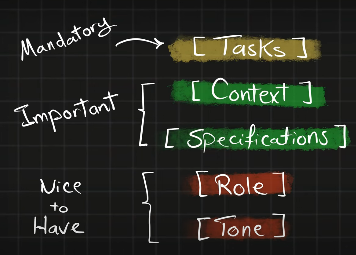
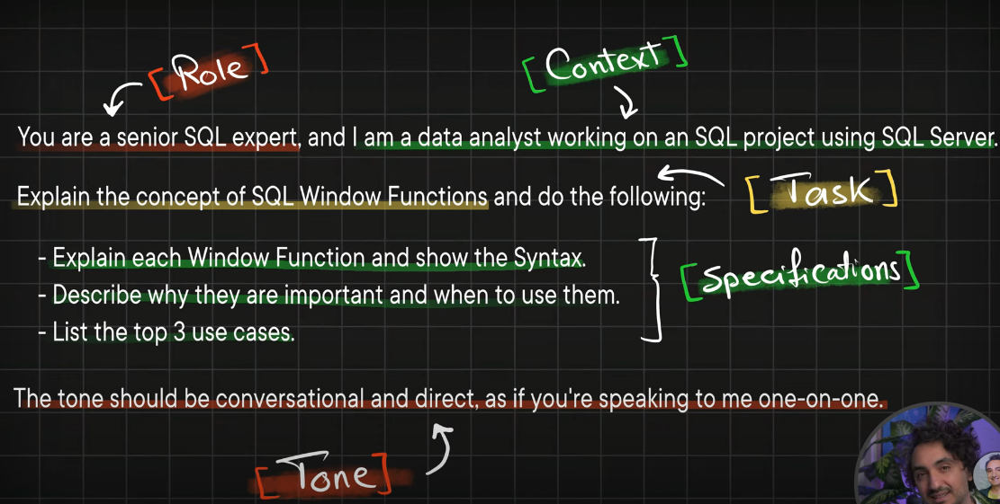

## **Prompt Example**

---

## **1- PROMPT: Solve an SQL Task**

- **[Context]**
    In my SQL Server database, we have two tables:
    - `orders` with the following columns: `order_id`, `sales`, `customer_id`, `product_id`.
    - `customers` with the following columns: `customer_id`, `first_name`, `last_name`, `country`.

- **[TASK]**
    - Write a query to rank customers based on their sales.
    - The result should include the customer's `customer_id`, full name, country, total sales, and their rank.
    - Include comments but avoid commenting on obvious parts.
    - Write three different versions of the query to achieve this task.
    - Evaluate and explain which version is best in terms of readability and performance.

---

## **2- PROMPT: Improve the Readability**

- **[Prompt Details]**
    *The following SQL Server query is long and hard to understand.*

    - Improve its readability.
    - Remove any redundancy in the query and consolidate it.
    - Include comments but avoid commenting on obvious parts.
    - Explain each improvement to understand the reasoning behind it.

**[_SQL Query GOES HERE_]**

---

## **3- PROMPT: Optimize the Performance Query**

- **[Prompt Details]**
    *The following SQL Server query is slow.*

    - Propose optimizations to improve its performance.
    - Provide the improved SQL query.
    - Explain each improvement to understand the reasoning behind it.

**[_SQL Query GOES HERE_]**

---

## **4- PROMPT: Optimize Execution Plan**

- **[Prompt Details]**
    *The image is the execution plan of an SQL Server query.*

    - Describe the execution plan step by step.
    - Identify performance bottlenecks and issues.
    - Suggest ways to improve performance and optimize the execution plan.

**[_SQL Query GOES HERE_]**

---

## **5- PROMPT: Debugging**

- **[Prompt Details]**
    *The following SQL Server query causes this error: **[Error Message GOES HERE]***

    - Explain the error message.
    - Find the root cause of the issue.
    - Suggest how to fix it.

**[_SQL Query GOES HERE_]**

---

## **6- PROMPT: Explain the Result**

- **[Prompt Details]**
    *I didn't understand the result of the following SQL Server query.*

    - Break down how SQL processes the query step by step.
    - Explain each stage and how the result is formed.

**[_SQL Query GOES HERE_]**

---

## **7- PROMPT: Styling & Formatting**

- **[Prompt Details]**
    *The following SQL Server query is hard to understand.*

    - Restyle the code to make it easier to read.
    - Align column aliases.
    - Keep it compact—do not introduce unnecessary new lines.
    - Ensure the formatting follows best practices.

**[_SQL Query GOES HERE_]**

---

## **8- PROMPT: Documentations & Comments**

- **[Prompt Details]**
    *The following SQL Server query lacks comments and documentation.*

    - Insert a leading comment at the start of the query describing its overall purpose.
    - Add comments only where clarification is necessary, avoiding obvious statements.
    - Create a separate document explaining the business rules implemented by the query.
    - Create another separate document describing how the query works.

**[_SQL Query GOES HERE_]**

---

## **9- PROMPT: Improve Database DDL**

- **[Prompt Details]**
    *The following SQL Server DDL Script has to be optimized.*

    - Naming: Check the consistency of table/column names, prefixes, standards.
    - Data Types: Ensure data types are appropriate and optimized.
    - Integrity: Verify the integrity of primary keys and foreign keys.
    - Indexes: Check that indexes are sufficient and avoid redundancy.
    - Normalization: Ensure proper normalization and avoid redundancy.

**[_SQL Query GOES HERE_]**

---

## **10- PROMPT: Generate Test Dataset**

- **[Prompt Details]**
    *I need a dataset for testing the following SQL Server DDL.*

    - Generate a test dataset as INSERT statements.
    - Ensure the dataset is realistic.
    - Keep the dataset small.
    - Ensure all primary/foreign key relationships are valid (use matching IDs).
    - Do not introduce any NULL values.

**[_SQL Query GOES HERE_]**

---

## **11- PROMPT: Create SQL Course**

- **[Prompt Details]**
    *Create a comprehensive SQL course with a detailed roadmap and agenda.*

    - Start with SQL fundamentals and advance to complex topics.
    - Make it beginner-friendly.
    - Include topics relevant to data analytics.
    - Focus on real-world data analytics use cases and scenarios.

---

## **12- PROMPT: Understand SQL Concept**

- **[Prompt Details]**
    *I want a detailed explanation about SQL Window Functions.*

    - Explain what Window Functions are.
    - Give an analogy.
    - Describe why we need them and when to use them.
    - Explain the syntax.
    - Provide simple examples.
    - List the top 3 use cases.

**[_SQL Query GOES HERE_]**

---

## **13- PROMPT: Comparing SQL Concepts**

- **[Prompt Details]**
    *I want to understand the differences between SQL Window Functions and GROUP BY.*

    - Explain the key differences between the two concepts.
    - Describe when to use each concept, with examples.
    - Provide the pros and cons of each concept.
    - Summarize the comparison in a clear side-by-side table.

**[_SQL Query GOES HERE_]**

---

## **14- PROMPT: Practice SQL**

- **[Prompt Details]**
    *Act as an SQL trainer and help me practice SQL Window Functions.*

    - Make it interactive: provide a task and give the solution.
    - Provide a sample dataset.
    - Act as an SQL Server and show the results of my queries.
    - Review my queries, provide feedback, and suggest improvements.

**[_SQL Query GOES HERE_]**

---

## **15- PROMPT: Prepare for a SQL Interview**

- **[Prompt Details]**
    *Act as an interviewer and prepare me for a SQL interview.*

    - Ask common SQL interview questions.
    - Make it interactive: provide questions and give answers.
    - Gradually progress to advanced topics.
    - Evaluate my answers and give feedback.

**[_SQL Query GOES HERE_]**
